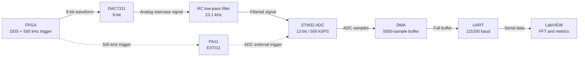

# STM32 + FPGA + DAC7311 — 500 kSPS Acquisition & Analysis Pipeline

Acquisition pipeline built around an STM32 Nucleo-C031C6 and a Spartan-7
SEA/FPGA board. The FPGA design is developed in Vivado as fully custom,
synthesizable VHDL.
The FPGA drives a TI DAC7311, used at 8-bit code resolution, to generate
sine, triangle and sawtooth waveforms and provides a 500 kHz trigger that
hardware-triggers the STM32 ADC via EXTI line 11.

The STM32 firmware is written entirely bare-metal at register level (no HAL),
developed in STM32CubeIDE with a 48 MHz system clock: ADC samples are moved by
DMA into a 5000-sample buffer and, when the buffer is full, a firmware state
machine streams it over UART to a LabVIEW (VISA) host that performs
coherent-sampling spectral analysis (SNR / SFDR / SINAD / THD / ENOB).

A simple RC reconstruction low-pass filter is placed between the DAC output
and the ADC input to smooth the staircase steps produced by the zero-order-hold
behavior of the DAC, attenuating high-frequency spectral images and reducing
aliasing artifacts in the sampled data.

## Features

- FPGA DDS drives the DAC7311 at 8-bit code resolution: sine / triangle / sawtooth;
- 500 kHz external trigger, EXTI line 11 routed as ADC hardware trigger;
- 12-bit ADC sampling at 500 kSPS, DMA-filled buffer (5000 samples);
- RC reconstruction low-pass filter between DAC and ADC;
- UART transmission of the full buffer after acquisition (no DMA needed);
- LabVIEW VISA host: coherent-sampling analysis, harmonic extraction, metric computation;
- Firmware written entirely bare-metal (no HAL): register-level programming using
  only the official reference manuals and the CMSIS libraries, running at 48 MHz;
- FPGA design developed entirely in Vivado for the Xilinx Spartan-7 (SEA board):
  fully custom, synthesizable VHDL with inferred ROMs (no vendor IP blocks or `.coe` files),
  carried through synthesis and implementation down to a working bitstream;
- MATLAB script stored in `data/` for waveform verification.




## Repository structure

```
├── README.md
├── docs/                         # links to manuals, references, datasheets
├── firmware/                     # bare-metal STM32C0 (ADC, DMA, EXTI, UART, FSM)
├── VHDL/                         # SEA board: DDS + 500 kHz trigger
├── labview/                      # VISA receiver + analysis VI
├── data/                         # (MATLAB script)
```

## Requirements (reproducibility)

**Hardware**

- STM32 Nucleo-C031C6;
- Seeed Studio SEA accelerator board (Xilinx Spartan-7) with DAC7311;
- RC reconstruction low-pass filter (see "Hardware setup" below);
- USB cables, jumper wires, common ground between the two boards;
- Oscilloscope;

**Software**

- STM32CubeIDE (developed and tested with v1.19.0);
- Xilinx Vivado ≥ 2019.1 (Spartan-7 toolchain);
- MATLAB or equivalent, to run waveform generation/verification scripts;
- LabVIEW ≥ 2021 SP1;
- Links to reference documentation (placed in the appropriate folder of this repo):
  RM0490, UM2953, STM32C031 datasheet, TI DAC7311 datasheet, ARM Cortex-M0+ user guide.

## How to clone this repository

### HTTPS (no SSH key required)

```bash
git clone https://github.com/gulotmg/fpga-mcu-dac-adc-conversion-pipeline.git
cd fpga-mcu-dac-adc-conversion-pipeline
```

### SSH (recommended if you already have an SSH key configured on GitHub)

```bash
git clone git@github.com/gulotmg/fpga-mcu-dac-adc-conversion-pipeline.git
cd fpga-mcu-dac-adc-conversion-pipeline
```

### GitHub CLI

```bash
gh repo clone gulotmg/fpga-mcu-dac-adc-conversion-pipeline
cd fpga-mcu-dac-adc-conversion-pipeline
```

### Download as ZIP

If you don't want to use Git, you can download the source code as a ZIP archive:

 [Download ZIP](https://github.com/gulotmg/fpga-mcu-dac-adc-conversion-pipeline/archive/refs/heads/main.zip)

 Repository link: https://github.com/gulotmg/fpga-mcu-dac-adc-conversion-pipeline

### After cloning

1. Refer to the **Requirements** section above to install the required toolchains
   (STM32CubeIDE, Vivado, LabVIEW, MATLAB).
2. Open `firmware/` in STM32CubeIDE to build and flash the STM32 firmware.
3. Open `VHDL/` in Vivado to synthesize, implement and program the bitstream on
   the SEA board.
4. Open `labview/` in LabVIEW to run the host receiver and analysis VI.
5. See the **Hardware setup** section below for the exact wiring between the two boards.

## Hardware setup

| Signal | MCU pin | Connector (UM2953) | Firmware configuration | Note |
|---|---|---|---|---|
| DAC7311 analog output (filtered) | PA1 — ADC_IN1, CH1 | Arduino A1 / morpho 12 | Analog mode; sampling time 12.5 ADC cycles | Waveform under test, after RC filter |
| 500 kHz trigger (FPGA) | PA11 — EXTI line 11 | Arduino A4 / morpho 33 | Digital input, pull-down, rising edge; routed as ADC hardware trigger (EXTSEL = 111, EXTEN = 01) | SEA board output |
| UART TX → PC | PA2 — USART2_TX | morpho 13 (VCP, SB27 ON) | AF1, 115200 8N1, BRR computed @ 48 MHz PCLK | One-way link (RX unused) |
| GND | common | — | — | Shared between SEA board and Nucleo |

### Reconstruction low-pass filter

A passive RC low-pass filter is placed between the DAC7311 output and the
STM32 ADC input to remove the high-frequency steps produced by the DAC's
zero-order-hold behavior, attenuate the spectral images above the signal band
and prevent them from being aliased back into the baseband by the ADC sampler.

- **Resistor**: 220 Ω in parallel with 100 Ω → $R \approx 68.75 \ \Omega$;
- **Capacitor**: 100 nF ceramic;
- **Cut-off frequency**: $f_c = \dfrac{1}{2\pi R C} \approx 23.1 \ \mathrm{kHz}$.

This cut-off is well above the maximum test signal frequency but well below
the 500 kSPS Nyquist limit, providing a smooth analog reconstruction of the
generated waveforms prior to sampling.

Note: PA11 is used only as the digital trigger (EXTI11); the analog
acquisition channel is PA1 / CH1.


Test bench: Nucleo-C031C6 (left), SEA/FPGA board (right), DAC7311 output probed on CH2; common ground via breadboard. The scope displays the DAC-generated sine wave acquired by the pipeline comparing filtered (blue) and unfiltered (yellow) at 8 kHz.

## FPGA DDS & Fixed-Point Frequency Generation

The waveform generator uses a 32-bit Direct Digital Synthesis (DDS) architecture reading from synthesizable inferred ROM lookup tables (256 samples × 8-bit), without vendor IP cores or `.coe` files.

The logic behind this is simple: instead of an 8-bit phase accumulator, we use 32 bits with fixed-point arithmetic. The top 8 bits (integer part) index the 256 samples in the ROM, while the lower 24 bits accumulate the decimal phase increment at each update. Adding a decimal step allows generating precise frequencies without drift.

Each DAC serial frame takes 42 clock cycles at 100 MHz (100 ns (10 cycles) inter-frame SYNC delay as imposed by DAC7311 datasheet + 32 serial clock cycles for 16 bits), giving a DAC update rate of:

$$f_s = \frac{100\text{ MHz}}{42} \approx 2.380952\text{ MSPS}$$

To generate exactly $f_{\text{out}} = 1000.00\text{ Hz}$, the 32-bit tuning word $M$ is calculated as:

$$M = \text{round}\left( \frac{f_{\text{out}} \cdot 42 \cdot 2^{32}}{f_{\text{clk}}} \right) = \text{round}\left( \frac{1000 \cdot 42 \cdot 4\,294\,967\,296}{100\,000\,000} \right) = 1\,803\,886$$

With $M = 1\,803\,886$, the effective output frequency is $999.99985\text{ Hz}$ (error $< 0.0002\text{ Hz}$), preventing phase drift and eliminating spectral leakage.

## How to run

1. Flash the firmware and power the Nucleo.
2. Power the SEA board, program the FPGA bitstream following the instructions
   in `VHDL/`, and connect the boards according to the pinout described above.
3. Open the LabVIEW VI, select the COM port and the baud rate, and run the VI.
4. Press the Nucleo reset button: the board acquires 5000 samples and transmits
   the buffer; LabVIEW plots and analyzes it.

## Measurement methodology

### Coherent sampling

The spectral analysis relies on **coherent sampling**: the record length $N$
is chosen so that each acquisition contains an **integer number of periods**
(exactly 10) of the generated sine wave. This makes the rectangular window
exact and completely eliminates spectral leakage.

$$N = 10 \cdot \frac{f_s}{f_{sig}} \qquad \text{with} \quad f_s = 500 \ \mathrm{kSPS}$$

Sweeping $N$ over the available record lengths yields the following test
frequencies (10 periods per record in every case):

| $N$ (samples) | $f_{sig}$ (kHz) | Periods in record |
|---|---|---|
| 625  | 8 | 10 |
| 1250  | 4 | 10 |
| 2500 | 2  | 10 |
| 5000 | 1  | 10 |

For each acquisition, all available harmonics (i.e., while they fall below the Nyquist frequency $f_s/2$) are extracted in order to calculate NAD (noise and distorsion) and 10 are extracted in order to calculate THD (total harmonic distorsion).

### Performance metrics of system with reconstruction filter

$$\mathrm{SNR} = 20 \log_{10}\left(\frac{V_{fund}}{V_{noise,\mathrm{rms}}}\right) \quad [\mathrm{dB}]$$

$$\mathrm{SFDR} = 20 \log_{10}\left(\frac{V_{fund}}{V_{spur,\mathrm{max}}}\right) \quad [\mathrm{dB}]$$

$$\mathrm{SINAD} = 20 \log_{10}\left(\frac{V_{fund}}{\sqrt{\sum_{h=2}^{N} V_{h}^{2} + V_{noise,\mathrm{rms}}^{2}}}\right) \quad [\mathrm{dB}]$$

$$\mathrm{THD} = 20 \log_{10}\left(\frac{\sqrt{\sum_{h=2}^{10} V_{h}^{2}}}{V_{fund}}\right) \quad [\mathrm{dB}]$$

$$\mathrm{ENOB} = \frac{\mathrm{SINAD} - 1.76}{6.02} \quad [\mathrm{bit}]$$

where:

- $V_{fund}$ : RMS amplitude of the fundamental at $f_{sig}$;
- $V_{noise,\mathrm{rms}}$ : RMS noise floor, excluding the fundamental and the extracted harmonics;
- $V_{spur,\mathrm{max}}$ : RMS amplitude of the largest spurious component;
- $V_{h}$ : RMS amplitude of the $h$-th harmonic, $h = 2 \dots N$;
- Noise RMS is calculated removing DC, fundamental and harmonic bins, along with their adjacent twos (3 bins removed per harmonic).

All metrics refer to the **complete chain**: DAC7311 + reconstruction filter + interconnect + STM32 ADC.

**VERY IMPORTANT NOTE** : previous metrics predicted ENOB at 1 kHz of around 8.7 bits. Considering the fact that the DAC is working at 8 bit resolution, that was not explicable without making very exotic assumptions. A better look at "IEEE Standard for Terminology and Test Methods for Analog-to-Digital Converters", showed the previous error: not enough harmonic distorsion was selected in LabVIEW to calculate SINAD, which requires *ALL* of it. Similarly THD requires only 10 harmonics to prevent noise to influence its value. Also a 4th order Sallen-Key filter has been developed and will be documented and used to retake measurements in a future update. At last, results without reconstruction filter have been removed since the standard also suggests to low pass filter the sine input used to calculate the parameters.

### Results WITH reconstruction filter (sine wave, $f_s = 500$ kSPS, 10 periods per record)

| $N$ | $f_{sig}$ (kHz) | SNR (dB) | SFDR (dB) | SINAD (dB) | THD (dB) | ENOB (bit) |
|---|---|---|---|---|---|---|
| 5000 | 1 | 71.4870 | 60.2496 | 44.4503 | −52.3189 | 7.0914 |
| 2500 | 2 | 68.4055 | 57.1823 | 42.9522 | −46.6650 | 6.8426 |
| 1250 | 4 | 65.8103 | 55.2023 | 38.7729 | −40.5015 | 6.1483 |
| 625  | 8 | 61.1062 | 50.9321 | 31.1176 | −31.4076 | 4.8767 |


*Image of "Front Panel" for filtered DAC generated 1kHz sinewave*


- As it can be seen, measurements with respects to previous commits, are more realistic and better reflect the setup that is being described in this repository. Referring to official standards is always the key to correct measurements.

## Known limitations and interpretation of results

- **8-bit DAC Resolution and ADC Bottleneck**: The DAC was intentionally restricted to 8-bit resolution in an attempt to characterize its specific baseline performance. Increasing the DAC's code resolution would hypothetically reduce its quantization noise, potentially shifting the system's bottleneck to the Nucleo's 12-bit SAR ADC, which specifies an ENOB of up to 10.2 bits under specific datasheet conditions. However, this assumes that the DAC's Total Harmonic Distortion (THD) and non-linearities remain below the ADC's noise floor. Therefore, it would be ideal to develop a separate testbench to evaluate the independent performance of each component, thus validating the assumptions regarding the former statement and the ones that follow.

- **Frequency-Dependent Performance and Phase Increment**: Under these conditions, the DAC is highly likely to be the primary bottleneck for the system's overall performance. As signal degradation becomes more pronounced at higher frequencies, the primary limiting factor in this specific implementation is plausibly the "Phase Increment" logic defined in the VHDL entity. Also, thanks to the passive RC filter, good improvement can be seen especially at higher frequencies, where the phase increments of the DDS spurious frequencies affect the system more and the reconstruction filter works like it's intended to. There was a previous issue related to spectral leakage around the fundamental. This has been fixed, since thanks to 32 bits phase accumulator a higher precision in frequency has been achieved.

- **System-Level vs. Component-Level Characterization**: Without a suitable "golden reference", the individual contributions of the ADC and DAC cannot be independently isolated. Therefore, this experiment is closer to characterizing the cascade performance of the entire signal chain rather than the independent performance of each component. Nevertheless, it can provide an indicative estimate of the DAC's performance at 8-bit resolution.

## References

- RM0490 : STM32C0x1/C0x3 reference manual (ADC, DMA, EXTI, USART)
- UM2953 : NUCLEO-C031C6 / NUCLEO-C051C8 user manual
- STM32C031 datasheet
- TI DAC7311 datasheet
- ARM Cortex-M0+ user guide
- Spartan 7 datasheet
- Spartan Edge Accelerator (SEA) user and experimental manuals and schematics

## License

MIT
