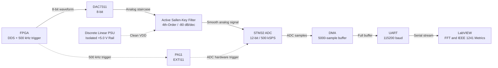
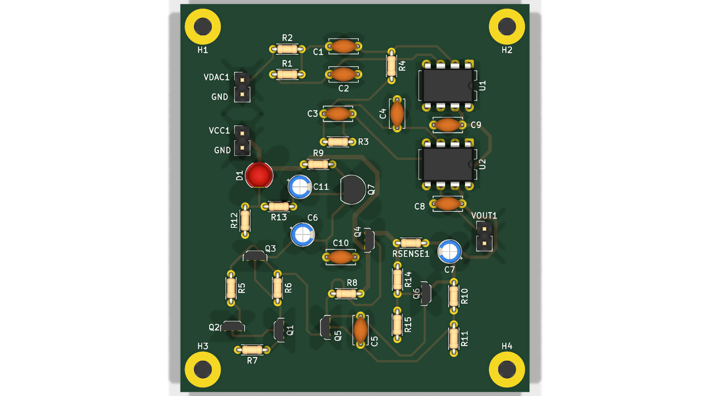
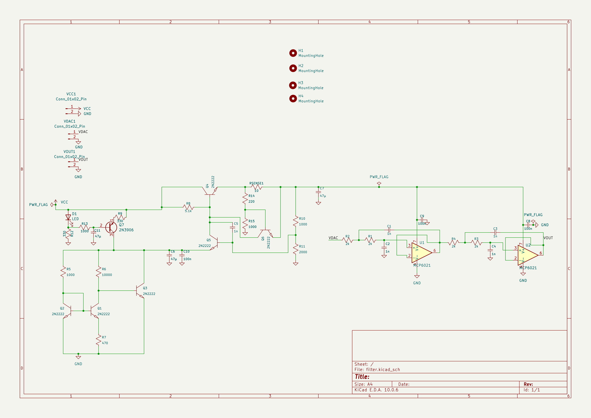
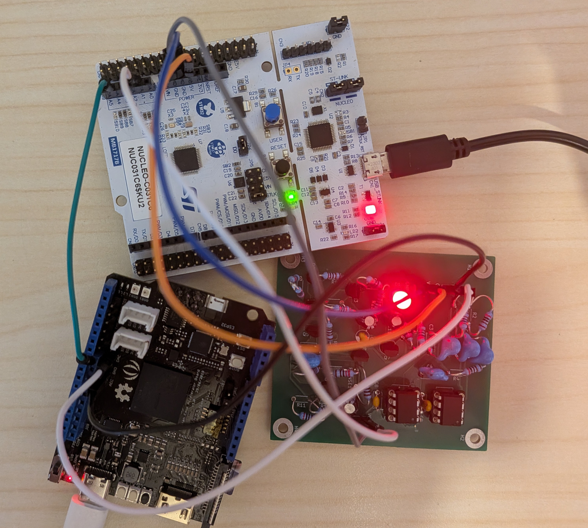
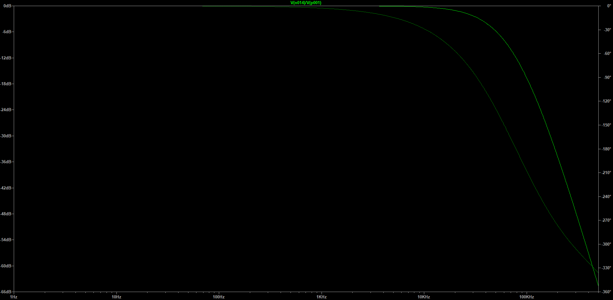
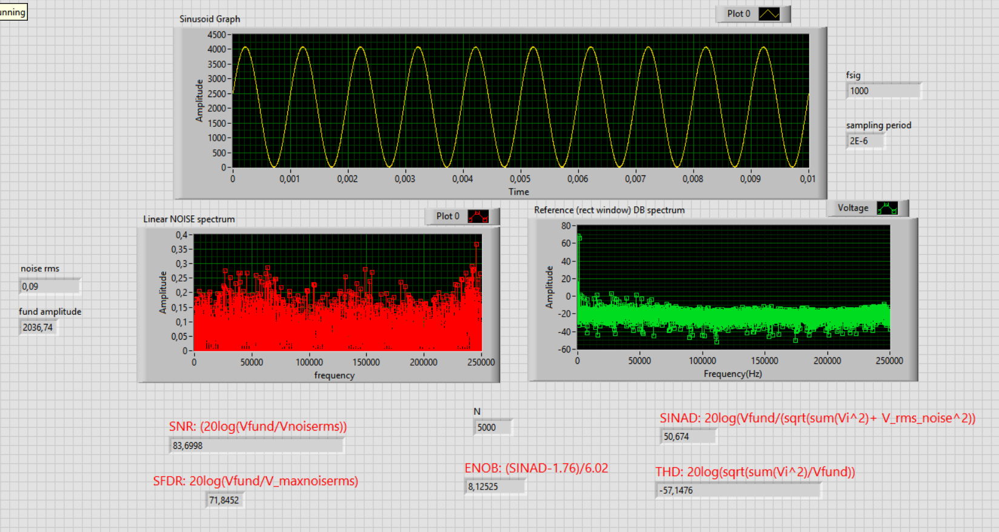

# STM32 + FPGA + DAC7311 - 500 kSPS Acquisition & Analysis Pipeline

[](https://opensource.org/licenses/MIT)

Acquisition and characterization pipeline built around an STM32 Nucleo-C031C6 and a Spartan-7 SEA/FPGA board. The FPGA design is developed in Vivado as fully custom, synthesizable VHDL. The FPGA drives a TI DAC7311, used at 8-bit code resolution, to generate sine, triangle, and sawtooth waveforms and provides a 500 kHz trigger that hardware-triggers the STM32 ADC via EXTI line 11.

The STM32 firmware is written entirely bare-metal at register level (no HAL), developed in STM32CubeIDE with a 48 MHz system clock: ADC samples are moved by DMA into a 5000-sample buffer and, when the buffer is full, a firmware state machine streams it over UART to a LabVIEW (VISA) host that performs coherent-sampling spectral analysis (SNR / SFDR / SINAD / THD / ENOB) according to IEEE Standard 1241-2023.

A dedicated analog reconstruction front-end is placed between the DAC output and the ADC input to smooth the staircase steps produced by the zero-order-hold (ZOH) DAC, eliminate out-of-band spectral images, and prevent aliasing artifacts. The repository also provides a comparison between a passive RC reconstruction filter and a custom-designed **4th-Order Active Sallen-Key Low-Pass Filter powered by a custom discrete regulator.**


## Table of Contents

- [Features](#features)
- [Hardware Setup](#hardware-setup)
- [Analog Filter Design](#analog-filter-design)
- [FPGA DDS & Frequency Generation](#fpga-dds--frequency-generation)
- [Measurement Methodology](#measurement-methodology)
- [Experimental Results & Comparative Analysis](#experimental-results--comparative-analysis)
- [Known Limitations & System Interpretation](#known-limitations--system-interpretation)
- [To Do](#to-do)
- [Repository Structure](#repository-structure)
- [Requirements (Reproducibility)](#requirements-reproducibility)
- [How to Clone and Run](#how-to-clone-and-run)
- [References](#references)
- [License](#license)

## Features

- **FPGA DDS Engine**: Generates sine / triangle / sawtooth waveforms at 8-bit code resolution with a 32-bit phase accumulator for sub-mHz frequency tuning without spectral leakage;
- **500 kHz Hardware Trigger**: EXTI line 11 routed internally as the hardware trigger for the STM32 ADC;
- **12-bit SAR ADC @ 500 kSPS**: DMA-driven circular/linear buffer acquisition (5000 samples);
- **Analog Reconstruction Filter Comparison**:
  - Baseline passive 1st-order RC filter ($f_c \approx 23.1\text{ kHz}$);
  - Upgraded custom **4th-Order Active Sallen-Key Low-Pass Filter ($f_c \approx 79.6\text{ kHz}$, $-80\text{ dB/dec}$ roll-off)** with rail-to-rail Microchip MCP6021 op-amps;
- **Discrete Linear Power Supply (+5.0 V DC)**: Dedicated on-board series pass regulator isolating the analog op-amp power rails from digital switching noise;
- **UART Data Stream**: High-throughput transmission of the full buffer after acquisition (115200 baud);
- **LabVIEW VISA Host**: Real-time spectral analysis, harmonic extraction, and dynamic parameter computation (SNR, SFDR, SINAD, THD, ENOB);
- **Bare-Metal Register-Level Firmware**: Developed without HAL/LL abstractions using official reference manuals (RM0490) and CMSIS headers at 48 MHz;
- **Custom VHDL Design**: Inferred ROM lookup tables (no vendor IP blocks or `.coe` files) implemented on Xilinx Spartan-7 based SEAB (Spartan Edge Accelerator Board);
- **MATLAB Verification**: DDS verification and LUT synthesis scripts in `data/`.




## Hardware Setup

| Signal | MCU Pin | Connector (UM2953) | Firmware Configuration | Note |
|---|---|---|---|---|
| **DAC7311 Analog Output (Filtered)** | PA1 - ADC_IN1, CH1 | Arduino A1 / morpho 12 | Analog mode; sampling time 12.5 ADC cycles | Signal under test, after reconstruction filter |
| **500 kHz Trigger (FPGA)** | PA11 - EXTI line 11 | Arduino A4 / morpho 33 | Digital input, pull-down, rising edge; ADC hardware trigger (EXTSEL = 111, EXTEN = 01) | SEA board output |
| **UART TX → PC** | PA2 - USART2_TX | morpho 13 (VCP, SB27 ON) | AF1, 115200 8N1, BRR computed @ 48 MHz PCLK | One-way telemetry link (RX unused) |
| **GND** | common | - | - | Shared ground plane between SEA board, PCB filter, and Nucleo |


## Analog Filter Design

### - Baseline Reconstruction Low-Pass Filter (Passive RC Prototype)

A passive 1st-order RC low-pass filter was initially placed between the DAC7311 output and the STM32 ADC input to remove high-frequency steps produced by the DAC zero-order-hold behavior, attenuate out-of-band spectral images, and prevent aliasing into the ADC baseband:

- **Resistor**: $\mathbf{220\,\Omega \parallel 100\,\Omega \implies R \approx 68.75\,\Omega}$;
- **Capacitor**: $\mathbf{100\text{ nF}}$ ceramic disc;
- **Cut-off Frequency**: $\mathbf{f_c = \dfrac{1}{2\pi R C} \approx 23.1\text{ kHz}}$.

This cut-off is placed well above the test signal frequencies ($1\text{–}8\text{ kHz}$) and below the $250\text{ kHz}$ Nyquist limit.

<p align="center">
  
</p>


*Initial breadboard test bench: Nucleo-C031C6 (left), SEA/FPGA board (right), DAC7311 output probed on CH2; common ground via breadboard. The scope displays the DAC-generated sine wave acquired by the pipeline comparing filtered (blue) and unfiltered (yellow) at 8 kHz.*


### - Upgraded 4th-Order Active Sallen-Key Filter & Discrete Linear Power Supply Design

To overcome the limitations of the passive prototype (limited $-20\text{ dB/decade}$ roll-off, impedance loading of the DAC, and parasitic noise pickup from breadboard), a custom 2-layer hardware PCB was engineered.



#### Subsystem Schematic & Circuit Details

<p align="center">
  
</p>


#### Physical Test Bench Setup (Updated Active Filter PCB)



*Updated test bench: Nucleo-C031C6 (top), Spartan-7 SEA FPGA board (bottom-left), and custom Active Filter & Discrete Linear Power Supply PCB (bottom-right). The boards share a common ground, with the DAC output routed through the 4th-order Sallen-Key active filter directly to STM32 ADC PA1 (CH1) and hardware-triggered at 500 kSPS via PA11.*


The board integrates two main sections on a single PCB:
1. **4th-Order Sallen-Key Active Low-Pass Filter**: Cascaded dual 2nd-order unity-gain stages built with low-noise, rail-to-rail Microchip MCP6021 op-amps ($10\text{ MHz}$ GBWP, $8.7\text{ nV}/\sqrt{\text{Hz}}$).
2. **Dedicated Discrete Series Pass Linear Regulator**: A discrete BJT voltage regulator providing an isolated, low-noise supply rail directly to the operational amplifiers.

#### Sallen-Key Filter Frequency Characteristic

The active filter implements a cascaded 4th-order unity-gain Sallen-Key low-pass topology with equal component values ($R = 2.0\text{ k}\Omega$, $C = 1.0\text{ nF}$):

$$\mathbf{f_0 \approx 79.58\text{ kHz}}$$

- **Passband Response ($1\text{–}8\text{ kHz}$)**: Virtually zero amplitude attenuation across the characterization range ($< 0.01\text{ dB}$ at $1\text{ kHz}$ and $< 0.35\text{ dB}$ at $8\text{ kHz}$).
- **Stopband Rejection**: Beyond $f_0$, the filter rolls off at **$-80\text{ dB/decade}$** ($-24\text{ dB/octave}$), strongly suppressing DAC staircase steps and aliasing images around Nyquist ($250\text{ kHz}$) and sampling rate ($500\text{ kSPS}$).



*LTspice AC analysis: Bode magnitude and phase response of the 4th-order Sallen-Key low-pass filter.*

---

#### Filter Power Supply Design Justification

While using an off-the-shelf monolithic LDO (such as an LM317, L7805, or LP2985) would have been more straightforward, designing a custom discrete series pass regulator was deliberately chosen for educational satisfaction since calculating thermal drift compensation, differential error tracking, Miller stability compensation, and foldback current limiting has been more interesting and rewarding. PSRR drops above $10\text{ kHz}$ (falling below $30\text{ dB}$ at $100\text{ kHz}\dots 1\text{ MHz}$) (this is also the reason why datasheets suggest to put a 100 nF capacitor close to the power supply). Since the power supply used (5V from the Nucleo) may generate high-frequency spikes precisely where op-amp PSRR is weakest, a quiet power supply definitely helps keeping supply noise from degrading dynamic spectral measurements of interest.

#### Sizing, Dimensioning & Thermal Compensation Analysis

The discrete regulator topology was sized and analyzed according to classical analog power supply design principles:

### A. Bandgap Reference Voltage ($\mathbf{V_{ref}}$ Derivation & Thermal Compensation)

#### 1. Biasing & Core Topology
Red LED $\mathbf{D_1}$ is used as the reference diode in order to drive a constant current generator (PNP transistor $\mathbf{Q_7}$ biased by $\mathbf{R_1 = 330\,\Omega}$, $\mathbf{R_2 = 330\,\Omega}$, $\mathbf{R_3 = 1.0\text{ k}\Omega}$, and bypass capacitor $\mathbf{C_1 = 47\,\mu\text{F}}$) that feeds the reference core. Forward-biased GaAsP red LEDs exhibit a negative forward voltage temperature coefficient ($\mathbf{\approx -2.0\text{ mV/}^\circ\text{C}}$), providing complementary thermal tracking.

The reference core consists of transistors $\mathbf{Q_1, Q_2, Q_3}$ and resistors $\mathbf{R_5 = 1.0\text{ k}\Omega}$, $\mathbf{R_6 = 10.0\text{ k}\Omega}$, $\mathbf{R_7 = 470\,\Omega}$:
- **Diode-connected $\mathbf{Q_2}$**: carries current $\mathbf{I_1}$ through collector resistor $\mathbf{R_5}$;
- **Degenerated $\mathbf{Q_1}$**: carries current $\mathbf{I_2}$ through collector resistor $\mathbf{R_6}$, with emitter degeneration resistor $\mathbf{R_7}$;
- **Feedback $\mathbf{Q_3}$**: base driven by the collector of $\mathbf{Q_1}$, emitter grounded, and collector tied to node $\mathbf{V_{ref}}$.

#### 2. Analytical Derivation
Neglecting base currents ($\mathbf{I_2 \approx I_{C(Q1)} \approx I_{E(Q1)}}$), the difference in base-emitter voltages appears directly across emitter degeneration resistor $\mathbf{R_7}$:

$$\mathbf{V_{BE(Q2)} - V_{BE(Q1)} = I_{E(Q1)} R_7 \cong I_2 R_7}$$

Using the fundamental BJT exponential relationship $\mathbf{I_C = I_S e^{V_{BE}/V_T} \implies V_{BE} = V_T \ln(I_C / I_S)}$, with thermal voltage $\mathbf{V_T = \frac{kT}{q} \approx 25.86\text{ mV}}$ (at $\mathbf{T = 300\text{ K}}$):

$$\mathbf{V_{BE(Q2)} - V_{BE(Q1)} = \frac{kT}{q} \left[ \ln\left(\frac{I_{C(Q2)}}{I_S}\right) - \ln\left(\frac{I_{C(Q1)}}{I_S}\right) \right] = \frac{kT}{q} \ln\left(\frac{I_1}{I_2}\right) = I_2 R_7}$$

Because $\mathbf{V_{BE(Q2)} \approx V_{BE(Q3)}}$, the voltage drops across the two collector load resistors balance ($\mathbf{I_1 R_5 \approx I_2 R_6 \implies \frac{I_1}{I_2} \approx \frac{R_6}{R_5}}$). Solving for the Proportional To Absolute Temperature (PTAT) current $\mathbf{I_2}$:

$$\mathbf{I_2 = \frac{1}{R_7} \frac{kT}{q} \ln\left(\frac{R_6}{R_5}\right)}$$

The reference voltage at node $\mathbf{V_{ref}}$ is taken at the collector of feedback transistor $\mathbf{Q_3}$:

$$\mathbf{V_{ref} = I_2 R_6 + V_{BE(Q3)} = V_{BE(Q3)} + \frac{R_6}{R_7} \frac{kT}{q} \ln\left(\frac{R_6}{R_5}\right)}$$

#### 3. Numerical Evaluation
Substituting circuit component values ($\mathbf{R_5 = 1.0\text{ k}\Omega}$, $\mathbf{R_6 = 10.0\text{ k}\Omega}$, $\mathbf{R_7 = 470\,\Omega}$, $\mathbf{V_T \approx 25.86\text{ mV}}$, and $\mathbf{V_{BE(Q3)} \approx 0.65\text{ V}}$):

$$\mathbf{\frac{R_6}{R_5} = \frac{10\text{ k}\Omega}{1.0\text{ k}\Omega} = 10 \implies \ln(10) \approx 2.303, \qquad \frac{R_6}{R_7} = \frac{10\,000\,\Omega}{470\,\Omega} \approx 21.28}$$

$$\mathbf{V_{ref} \approx 0.65\text{ V} + 21.28 \times 25.86\text{ mV} \times 2.303 \approx 0.65\text{ V} + 1.267\text{ V} \approx 1.92\text{ V}}$$

#### 4. Thermal Drift Compensation
The temperature variation of the reference voltage is expressed as:

$$\mathbf{\Delta V_{ref} = \Delta V_{BE(Q3)} + \frac{R_6}{R_7} \frac{k\,\Delta T}{q} \ln\left(\frac{R_6}{R_5}\right)}$$

The negative temperature coefficient of $\mathbf{V_{BE(Q3)}}$ ($\mathbf{\approx -2.2\text{ mV/}^\circ\text{C}}$) is compensated by the positive temperature coefficient of the PTAT voltage term, minimizing thermal drift across temperature.

Since the circuit includes foldback short-circuit protection but no overvoltage clamp (for design simplicity), it is strongly recommended not to exceed $\mathbf{+10\text{ V}}$ DC supply to protect the components.


### B. Closed-Loop Output Voltage Scaling

The feedback divider formed by $\mathbf{R_{10} = 1.0\text{ k}\Omega}$ and $\mathbf{R_{11} = 2.0\text{ k}\Omega}$ compares the output voltage against the error amplifier base-emitter junction and reference voltage ($\mathbf{V_{BE(Q5)} + V_{ref}}$):

$$\mathbf{V_{\text{feedback}} = V_O \cdot \frac{R_{11}}{R_{10} + R_{11}} = V_O \cdot \frac{2.0\text{ k}\Omega}{1.0\text{ k}\Omega + 2.0\text{ k}\Omega} = \frac{2}{3} V_O \equiv V_{BE(Q5)} + V_{ref}}$$

$$\mathbf{V_{O,\text{ideal}} = (V_{BE(Q5)} + V_{ref}) \cdot \left( 1 + \frac{R_{10}}{R_{11}} \right) = 1.5 \cdot (V_{BE(Q5)} + V_{ref})}$$

Using $\mathbf{V_{ref} \approx 1.92\text{ V}}$ calculated above and nominal $\mathbf{V_{BE(Q5)} \approx 0.65\text{ V}}$:

$$\mathbf{V_{O,\text{ideal}} = 1.5 \cdot (0.65\text{ V} + 1.92\text{ V}) = 1.5 \cdot 2.57\text{ V} \approx 3.86\text{ V}}$$


### C. Loop Stability & Miller Compensation

To guarantee unconditional stability under reactive loads, capacitor $\mathbf{C_5 = 1.0\text{ nF}}$ is placed across the collector-base junction of pass driver $\mathbf{Q_5}$. Via the Miller effect, the equivalent capacitance seen at the driver base is multiplied by the stage voltage gain:

$$\mathbf{C_{\text{Miller}} = C_5 \cdot (1 + |A_v|)}$$

This creates a dominant low-frequency pole, rolling off loop gain well before parasitic phase shifts from the series pass transistor $\mathbf{Q_4}$ and output decoupling capacitors can degrade phase margin, ensuring a stable power supply and preventing potential oscillations.


### D. Foldback Current Limiting

Resistor $\mathbf{R_{sense} = 10\,\Omega}$ senses the load current $\mathbf{I_L}$ delivered by series pass transistor $\mathbf{Q_4}$. A resistive divider formed by $\mathbf{R_{F1} = R_{14} = 220\,\Omega}$ and $\mathbf{R_{F2} = R_{15} = 1.0\text{ k}\Omega}$ biases sense transistor $\mathbf{Q_6}$ (2N2222), whose emitter is tied to $\mathbf{V_O}$:

$$\mathbf{V_{BE, Q6} = (V_O + I_L R_{sense}) \frac{R_{F2}}{R_{F1} + R_{F2}} - V_O}$$

Imposing $\mathbf{V_{BE, Q6} = 0.6\text{ V}}$ at the activation threshold gives:

$$\mathbf{0.6\text{ V} = (V_O + I_{th} R_{sense}) \frac{R_{F2}}{R_{F1} + R_{F2}} - V_O}$$

Solving for the threshold current $\mathbf{I_{th}}$:

$$\mathbf{I_{th} = \frac{0.6\text{ V}}{R_{sense}} \left( 1 + \frac{R_{F1}}{R_{F2}} \right) + \frac{V_O}{R_{sense}} \left( \frac{R_{F1}}{R_{F2}} \right)}$$

Under dead short-circuit conditions ($\mathbf{V_O = 0\text{ V}}$), the output current folds back to:

$$\mathbf{I_{sc} = \frac{0.6\text{ V}}{R_{sense}} \left( 1 + \frac{R_{F1}}{R_{F2}} \right) = \frac{0.6\text{ V}}{10\,\Omega} \left( 1 + \frac{220\,\Omega}{1000\,\Omega} \right) = 73.2\text{ mA}}$$

Substituting $\mathbf{V_{O,\text{ideal}} \approx 3.86\text{ V}}$ obtained from the bandgap reference and closed-loop scaling equations, the current threshold before regulation drop is:

$$\mathbf{I_{th} = 73.2\text{ mA} + \frac{3.86\text{ V}}{10\,\Omega} \left( \frac{220\,\Omega}{1000\,\Omega} \right) = 73.2\text{ mA} + 84.9\text{ mA} \approx 158.1\text{ mA}}$$

When load current exceeds $\mathbf{I_{th}}$, $\mathbf{Q_6}$ conducts and shunts base drive current away from driver $\mathbf{Q_5}$ and series pass $\mathbf{Q_4}$, folding back the output current from $\mathbf{I_{th} \approx 158.1\text{ mA}}$ down to $\mathbf{I_{sc} \approx 73.2\text{ mA}}$. This limits the maximum short-circuit power dissipation to:

$$\mathbf{P_{diss,\max} = V_{IN} \cdot I_{sc} = 5.0\text{ V} \times 73.2\text{ mA} \approx 366\text{ mW}}$$

protecting the series pass transistor from thermal runaway.


## FPGA DDS & Frequency Generation

The waveform generator uses a 32-bit Direct Digital Synthesis (DDS) architecture reading from synthesizable inferred ROM lookup tables (256 samples × 8-bit), without vendor IP cores or `.coe` files.

The logic behind this is simple: instead of an 8-bit phase accumulator, we use 32 bits with fixed-point arithmetic. The top 8 bits (integer part) index the 256 samples in the ROM, while the lower 24 bits accumulate the decimal phase increment at each update. Adding a decimal step allows generating precise frequencies without drift.

Each DAC serial frame takes 42 clock cycles at 100 MHz (100 ns / 10 cycles inter-frame SYNC delay as imposed by DAC7311 datasheet + 32 serial clock cycles for 16 bits).

To generate exactly $f_{\text{out}} = 1000.00\text{ Hz}$, the 32-bit tuning word $M$ is calculated as:

$$M = \text{round}\left( \frac{f_{\text{out}} \cdot 42 \cdot 2^{32}}{f_{\text{clk}}} \right) = \text{round}\left( \frac{1000 \cdot 42 \cdot 4\,294\,967\,296}{100\,000\,000} \right) = 1\,803\,886$$

With $M = 1\,803\,886$, the effective output frequency is $999.99985\text{ Hz}$ (error $< 0.0002\text{ Hz}$), preventing phase drift and eliminating spectral leakage.


## Measurement Methodology

### Coherent Sampling

The spectral analysis relies on **coherent sampling**: the record length $N$ is chosen so that each acquisition contains an **integer number of periods** (exactly 10) of the generated sine wave. This makes the rectangular window exact and completely eliminates spectral leakage.

$$N = 10 \cdot \frac{f_s}{f_{sig}} \qquad \text{with} \quad f_s = 500\text{ kSPS}$$

Sweeping $N$ over the available record lengths yields the following test frequencies (10 periods per record in every case):

| $N$ (samples) | $f_{sig}$ (kHz) | Periods in record |
|:---:|:---:|:---:|
| 5000 | 1 | 10 |
| 2500 | 2 | 10 |
| 1250 | 4 | 10 |
| 625  | 8 | 10 |

For each acquisition, all available harmonics (below Nyquist $f_s/2$) are extracted to calculate SINAD, and the first 10 harmonics are used to compute THD according to IEEE Standard 1241-2023.

### Performance Metrics Definitions

$$\mathrm{SNR} = 20 \log_{10}\left(\frac{V_{fund}}{V_{noise,\mathrm{rms}}}\right) \quad [\mathrm{dB}]$$

$$\mathrm{SFDR} = 20 \log_{10}\left(\frac{V_{fund}}{V_{spur,\mathrm{max}}}\right) \quad [\mathrm{dB}]$$

$$\mathrm{SINAD} = 20 \log_{10}\left(\frac{V_{fund}}{\sqrt{\sum_{h=2}^{N} V_{h}^{2} + V_{noise,\mathrm{rms}}^{2}}}\right) \quad [\mathrm{dB}]$$

$$\mathrm{THD} = 20 \log_{10}\left(\frac{\sqrt{\sum_{h=2}^{10} V_{h}^{2}}}{V_{fund}}\right) \quad [\mathrm{dB}]$$

$$\mathrm{ENOB} = \frac{\mathrm{SINAD} - 1.76}{6.02} \quad [\mathrm{bit}]$$

where:
- $V_{fund}$: RMS amplitude of the fundamental at $f_{sig}$;
- $V_{noise,\mathrm{rms}}$: RMS noise floor, excluding the fundamental and extracted harmonics (removing DC, fundamental, and 3 bins per harmonic);
- $V_{spur,\mathrm{max}}$: RMS amplitude of the largest spurious component;
- $V_{h}$: RMS amplitude of the $h$-th harmonic, $h = 2 \dots N$.


## Experimental Results & Comparative Analysis

All metrics refer to the **complete signal chain**: DAC7311 + Filter Subsystem + Interconnect + STM32 ADC.

### 1. Baseline Performance: Passive 1st-Order RC Filter

| $N$ | $f_{sig}$ (kHz) | SNR (dB) | SFDR (dB) | SINAD (dB) | THD (dB) | ENOB (bit) |
|:---:|:---:|:---:|:--:|:---:|:---:|:---:|
| 5000 | 1 | 71.4870 | 60.2496 | 44.4503 | −52.3189 | 7.0914 |
| 2500 | 2 | 68.4055 | 57.1823 | 42.9522 | −46.6650 | 6.8426 |
| 1250 | 4 | 65.8103 | 55.2023 | 38.7729 | −40.5015 | 6.1483 |
| 625  | 8 | 61.1062 | 50.9321 | 31.1176 | −31.4076 | 4.8767 |

### 2. Enhanced Performance: 4th-Order Active Sallen-Key Filter & Discrete PSU

| $N$ | $f_{sig}$ (kHz) | SNR (dB) | SFDR (dB) | SINAD (dB) | THD (dB) | ENOB (bit) |
|:---:|:---:|:---:|:--:|:---:|:---:|:---:|
| 5000 | 1 | **83.6998** | **71.8452** | **50.6740** | **−57.1476** | **8.1253** |
| 2500 | 2 | **80.2193** | **67.4081** | **50.5249** | **−53.0489** | **8.1005** |
| 1250 | 4 | **76.5753** | **62.8830** | **47.9556** | **−48.5245** | **7.6737** |
| 625  | 8 | **73.1251** | **62.3415** | **42.7538** | **−42.8655** | **6.8096** |

### 3. Side-by-Side Comparison: Passive RC vs. Active Sallen-Key Filter

| $f_{sig}$ | Record $N$ | Configuration | SNR (dB) | SFDR (dB) | SINAD (dB) | THD (dB) | ENOB (bit) | $\Delta\text{ENOB}$ |
|:--:|:--:|:--|:---:|:---:|:---:|:--:|:--:|:--:|
| **1 kHz** | 5000 | Passive RC | 71.49 | 60.25 | 44.45 | −52.32 | 7.09 | - |
| | | **Active 4th-Order** | **83.70** | **71.85** | **50.67** | **−57.15** | **8.13** | **+1.04 bit** |
| **2 kHz** | 2500 | Passive RC | 68.41 | 57.18 | 42.95 | −46.67 | 6.84 | - |
| | | **Active 4th-Order** | **80.22** | **67.41** | **50.52** | **−53.05** | **8.10** | **+1.26 bit** |
| **4 kHz** | 1250 | Passive RC | 65.81 | 55.20 | 38.77 | −40.50 | 6.15 | - |
| | | **Active 4th-Order** | **76.58** | **62.88** | **47.96** | **−48.52** | **7.67** | **+1.52 bit** |
| **8 kHz** | 625 | Passive RC | 61.11 | 50.93 | 31.12 | −31.41 | 4.88 | - |
| | | **Active 4th-Order** | **73.13** | **62.34** | **42.75** | **−42.87** | **6.81** | **+1.93 bit** |

### LabVIEW Spectral Analysis Front Panel (Active Filter)



*LabVIEW dynamic parameter characterization (coherent acquisition record) with the 4th-order active filter and discrete linear regulator.*


## Known Limitations & System Interpretation

- **8-bit DAC Resolution and ADC Bottleneck**: The DAC was intentionally operated at 8-bit resolution to characterize its baseline performance. With the 4th-order active filter and clean discrete linear PSU, the measured ENOB at $1\text{ kHz}$ reaches $8.13\text{ bits}$, demonstrating that the signal chain preserves the full theoretical resolution of the DAC.
- **Frequency-Dependent Roll-Off & Phase Increment**: At higher frequencies ($8\text{ kHz}$), the DDS phase step increases, exciting higher-frequency quantization steps. The steep $-80\text{ dB/decade}$ roll-off of the active filter maintains ENOB at $6.81\text{ bits}$, whereas the passive filter degraded to $4.88\text{ bits}$.
- **Solid Ground Plane & Layout Integrity**: The 100% continuous solid ground plane on `B.Cu` with zero routing breaks eliminates ground loop currents between the FPGA, DAC, and ADC.


## To Do

- **Full Measurement Pipeline Automation**: Fully automate the end-to-end characterization pipeline directly from LabVIEW by establishing bidirectional communication from the host PC through the STM32 Nucleo to the Spartan-7 FPGA, allowing dynamic run-time frequency selection (1 kHz, 2 kHz, 4 kHz, 8 kHz), automatic record acquisition, and hands-free sweep computation of dynamic metrics.


## Repository Structure

```
├── README.md                     # Main pipeline documentation
├── docs/                         # Datasheets, manuals, IEEE standards
├── firmware/                     # Bare-metal STM32C031 firmware (ADC, DMA, EXTI, UART)
├── VHDL/                         # Spartan-7 FPGA design (DDS, 500 kHz trigger, DAC driver)
├── labview/                      # VISA host receiver and analysis VI
├── data/                         # Waveform generator and LUT synthesis scripts
├── filter/                       # Analog front-end & discrete PSU hardware
│   ├── pcb/                      # KiCad project, schematic (.kicad_sch), and layout (.kicad_pcb)
│   └── simulation/               # LTspice circuit (.asc), MCP6021 model (.lib), and PWL stimulus files
└──├── img/                          # Schematics, 3D PCB renders, test bench photos, and scope captures
```


## Requirements (Reproducibility)

**Hardware**

- STM32 Nucleo-C031C6 development board;
- Seeed Studio Spartan Edge Accelerator (SEA) board (Xilinx Spartan-7) with TI DAC7311;
- **Active Filter & Discrete Linear Power Supply PCB** (2x Microchip MCP6021, 6x 2N2222, 1x 2N3906, 1x Red LED, $2.0\text{ k}\Omega$ 1% resistors, $1.0\text{ nF}$ capacitors);
- Passive 1st-order RC reconstruction filter ($68.75\,\Omega$, $100\text{ nF}$) for baseline comparison;
- Regulated DC Power Supply (+5.0 V DC or +7.0 V to +12.0 V DC);
- Oscilloscope (for live signal probing);
- USB cables, jumper wires, common ground connection between boards.

**Software & EDA Tools**

- **STM32CubeIDE** (tested with v1.19.0) - bare-metal C compiler and debugger;
- **Xilinx Vivado** ≥ 2019.1 - Spartan-7 VHDL synthesis and bitstream programming;
- **KiCad EDA** ≥ 8.0 / 10.0 (designed in KiCad 10.0.6) - hardware schematic capture and PCB layout;
- **LTspice** (XVII / 24) - analog circuit simulation and AC/transient verification;
- **MATLAB** or **GNU Octave** - DDS LUT generation and verification scripts (`data/WAVE_GEN.m`);
- **LabVIEW** ≥ 2021 SP1 with **NI-VISA** - host acquisition and FFT spectral analysis.


## How to Clone and Run

```bash
git clone https://github.com/gulotmg/fpga-mcu-dac-adc-conversion-pipeline.git
cd fpga-mcu-dac-adc-conversion-pipeline
```

### Execution Steps

1. **Build and Program FPGA**: Open `VHDL/` in Vivado, synthesize the bitstream, and program the Spartan-7 SEA board.
2. **Flash STM32 Firmware**: Open `firmware/DMA_nucleoC03_ADC` in STM32CubeIDE, compile, and flash the Nucleo-C031C6.
3. **Hardware Interconnect**:
   - Connect DAC7311 output from SEA board to `VDAC1` on the Active Filter PCB;
   - Connect `VOUT1` on the Active Filter PCB to Nucleo PA1 (`ADC_IN1`);
   - Connect SEA 500 kHz trigger to Nucleo PA11 (`EXTI11`);
   - Ensure a common GND rail is shared across all three boards;
   - Power the Active Filter PCB via `VCC1` (+5.0 V DC).
4. **Host Spectral Analysis**:
   - Open `labview/Dynamic_parameters_calculator.vi` in LabVIEW;
   - Select the Nucleo Virtual COM Port (115200 baud) and run the VI;
   - Press the Nucleo `B1` reset button to trigger acquisition of 5000 samples and observe the FFT and IEEE 1241 metrics.


## References

- RM0490: STM32C0x1/C0x3 Reference Manual (ADC, DMA, EXTI, USART);
- UM2953: NUCLEO-C031C6 / NUCLEO-C051C8 User Manual;
- Texas Instruments DAC7311 Datasheet: 12-Bit, Low Power, Single-Channel DAC;
- Microchip MCP6021/2/3/4 Datasheet: Rail-to-Rail Input/Output 10 MHz Op-Amps;
- IEEE Std 1241-2023: IEEE Standard for Terminology and Test Methods for Analog-to-Digital Converters;
- TI Application Report SLOA049D: *Active Filter Design Techniques*;
- TI Application Report SBOA226: *Active Low-Pass Filter Design*.


## License

This project is licensed under the **MIT License**. You are free to use, modify, and distribute this software in compliance with the license terms.

