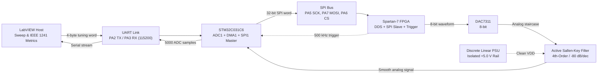
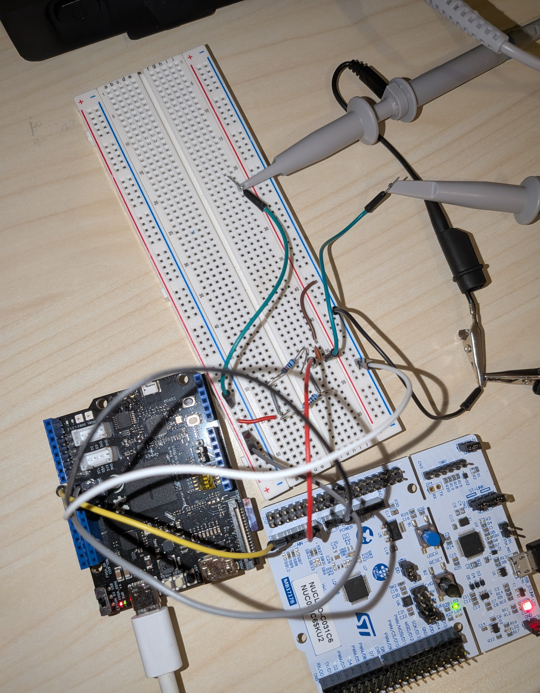
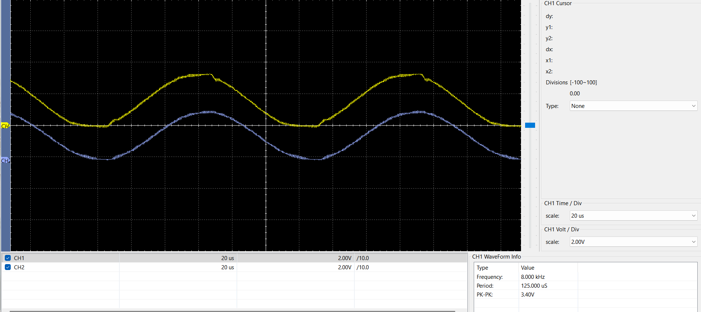
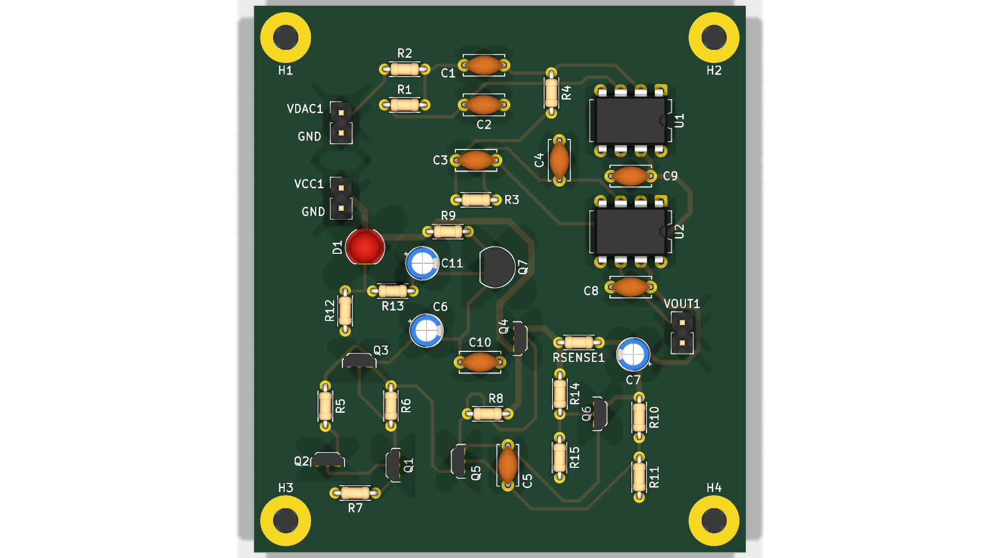
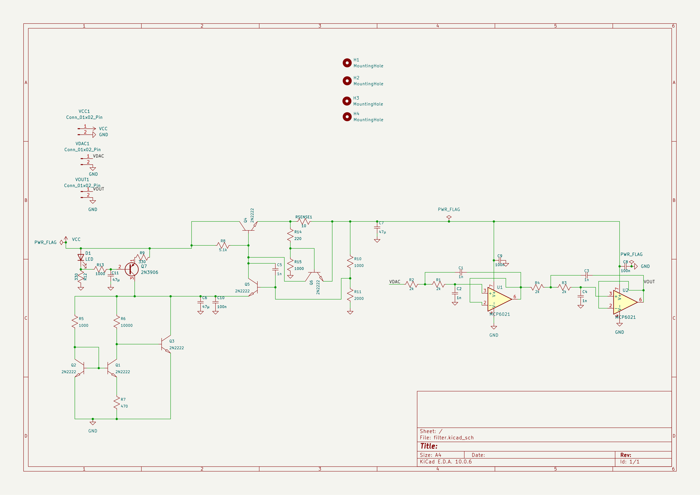
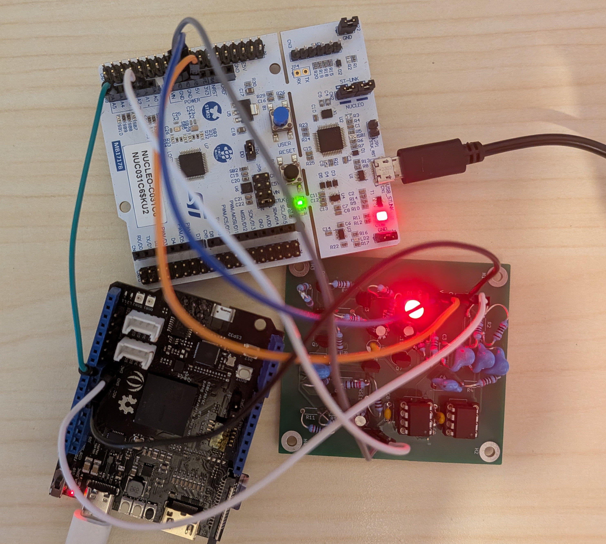
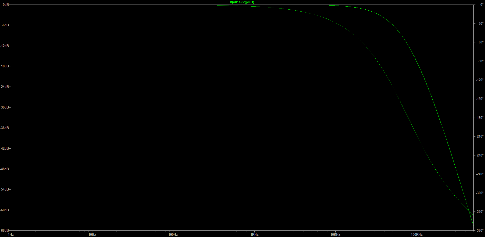

# STM32 + FPGA + DAC7311 - 500 kSPS Acquisition & Analysis Pipeline

[](https://opensource.org/licenses/MIT)
[](LICENSE-HARDWARE)
[](https://www.st.com/en/microcontrollers-microprocessors/stm32c031c6.html)
[](https://www.xilinx.com/products/silicon-devices/fpga/spartan-7.html)
[](https://kicad.org/)

Acquisition and characterization pipeline built around an STM32 Nucleo-C031C6 and a Spartan-7 SEA/FPGA board. The FPGA design is developed in Vivado as fully custom, synthesizable VHDL. The FPGA drives a TI DAC7311, used at 8-bit code resolution, to generate sine, triangle, and sawtooth waveforms and provides a 500 kHz trigger that hardware-triggers the STM32 ADC via EXTI line 11.

The STM32 firmware is written entirely bare-metal at register level (no HAL), developed in STM32CubeIDE with a 48 MHz system clock: ADC samples are moved by DMA into a 5000-sample buffer and, when the buffer is full, a firmware state machine streams it over UART to a LabVIEW (VISA) host that performs coherent-sampling spectral analysis (SNR / SFDR / SINAD / THD / ENOB) according to IEEE Standard 1241-2023.

The system features end-to-end automation: the LabVIEW host coordinates runtime frequency sweeps by sending 32-bit DDS tuning words over UART to the STM32. The STM32 bridges the tuning word to the Spartan-7 FPGA via SPI, re-arms the DMA channel, and triggers the ADC automatically without requiring manual board resets.

A dedicated analog reconstruction front-end is placed between the DAC output and the ADC input to smooth the staircase steps produced by the zero-order-hold (ZOH) DAC, eliminate out-of-band spectral images, and prevent aliasing artifacts. The repository also provides a comparison between a passive RC reconstruction filter and a custom-designed **4th-Order Active Sallen-Key Low-Pass Filter powered by a custom discrete regulator.**


## Table of Contents

- [Features](#features)
- [Hardware Setup](#hardware-setup)
- [Analog Filter Design](#analog-filter-design)
- [FPGA DDS & Frequency Generation](#fpga-dds--frequency-generation)
- [Measurement Methodology](#measurement-methodology)
- [Experimental Results & Comparative Analysis](#experimental-results--comparative-analysis)
- [Known Limitations & System Interpretation](#known-limitations--system-interpretation)
- [To Do](#to-do)
- [Repository Structure](#repository-structure)
- [Requirements (Reproducibility)](#requirements-reproducibility)
- [How to Clone and Run](#how-to-clone-and-run)
- [References](#references)
- [License](#license)

## Features

- **Automated Frequency Sweep**: LabVIEW host coordinates runtime frequency sweeps by transmitting 32-bit tuning words over UART; STM32 updates the FPGA DDS over SPI1 master mode and re-arms DMA/ADC without requiring manual resets;
- **Runtime SPI Slave DDS Configuration**: Spartan-7 FPGA receives 32-bit tuning words on the fly, updating frequency and phase-aligning the DDS accumulator;
- **FPGA DDS Engine**: Generates sine / triangle / sawtooth waveforms at 8-bit code resolution with a 32-bit phase accumulator for sub-mHz frequency tuning without spectral leakage;
- **500 kHz Hardware Trigger**: EXTI line 11 routed internally as the hardware trigger for the STM32 ADC;
- **12-bit SAR ADC @ 500 kSPS**: DMA-driven circular/linear buffer acquisition (5000 samples);
- **Analog Reconstruction Filter Comparison**:
  - Baseline passive 1st-order RC filter ($f_c \approx 23.1\text{ kHz}$);
  - Upgraded custom **4th-Order Active Sallen-Key Low-Pass Filter ($f_c \approx 79.6\text{ kHz}$, $-80\text{ dB/dec}$ roll-off)** with rail-to-rail Microchip MCP6021 op-amps;
- **Discrete Linear Power Supply (+5.0 V DC)**: Dedicated on-board series pass regulator isolating the analog op-amp power rails from digital switching noise;
- **UART Data Stream**: High-throughput transmission of the full buffer after acquisition (115200 baud);
- **LabVIEW VISA Host**: Real-time spectral analysis, harmonic extraction, and dynamic parameter computation (SNR, SFDR, SINAD, THD, ENOB);
- **Bare-Metal Register-Level Firmware**: Developed without HAL/LL abstractions using official reference manuals (RM0490) and CMSIS headers at 48 MHz;
- **Custom VHDL Design**: Inferred ROM lookup tables (no vendor IP blocks or `.coe` files) implemented on Xilinx Spartan-7 based SEAB (Spartan Edge Accelerator Board);
- **MATLAB Verification**: DDS verification and LUT synthesis scripts in `data/`.


```mermaid
flowchart LR
    LABVIEW["LabVIEW Host<br/>Sweep & IEEE 1241 Metrics"]
    UART["UART Link<br/>PA2 TX / PA3 RX (115200)"]
    MCU["STM32C031C6<br/>ADC1 + DMA1 + SPI1 Master"]
    SPI["SPI Bus<br/>PA5 SCK, PA7 MOSI, PA6 CS"]
    FPGA["Spartan-7 FPGA<br/>DDS + SPI Slave + Trigger"]
    DAC["DAC7311<br/>8-bit"]
    FILTER["Active Sallen-Key Filter<br/>4th-Order / -80 dB/dec"]
    PSU["Discrete Linear PSU<br/>Isolated +5.0 V Rail"]

    LABVIEW -->|4-byte tuning word| UART
    UART --> MCU
    MCU -->|32-bit SPI word| SPI
    SPI --> FPGA
    FPGA -->|8-bit waveform| DAC
    FPGA -.->|500 kHz trigger| MCU
    DAC -->|Analog staircase| FILTER
    PSU -.->|Clean VDD| FILTER
    FILTER -->|Smooth analog signal| MCU
    MCU -->|5000 ADC samples| UART
    UART -->|Serial stream| LABVIEW
```


## Hardware Setup

| Signal | MCU Pin | Spartan-7 SEA Pin | Connector (UM2953) | Firmware Configuration | Note |
|---|---|---|---|---|---|
| **DAC7311 Analog Output (Filtered)** | PA1 - ADC_IN1, CH1 | - | Arduino A1 / morpho 12 | Analog mode; sampling time 12.5 ADC cycles | Signal under test, after reconstruction filter |
| **500 kHz Trigger (FPGA)** | PA11 - EXTI line 11 | N14 (FPGA_IO0) | Arduino A4 / morpho 33 | Digital input, pull-down, rising edge; ADC hardware trigger (EXTSEL = 111, EXTEN = 01) | SEA board trigger output |
| **SPI Chip Select** | PA6 | M14 (FPGA_IO1) | morpho 13 / D12 | Push-pull GPIO output, active-low | Software NSS from MCU to FPGA |
| **SPI Serial Clock** | PA5 - SPI1_SCK | C4 (FPGA_IO2) | morpho 11 / D13 | AF0, SPI1 Master clock | SCLK to FPGA |
| **SPI MOSI** | PA7 - SPI1_MOSI | B13 (FPGA_IO3) | morpho 15 / D11 | AF0, SPI1 Master simplex transmit | 32-bit tuning word data to FPGA |
| **UART TX -> PC** | PA2 - USART2_TX | - | morpho 35 (VCP) | AF1, 115200 8N1, BRR computed @ 48 MHz PCLK | Telemetry stream: 5000 ADC samples |
| **UART RX <- PC** | PA3 - USART2_RX | - | morpho 37 (VCP) | AF1, 115200 8N1, RXNE interrupt enabled | Command reception: 4-byte phase word |
| **GND** | common | GND | - | - | Shared ground plane between SEA board, PCB filter, and Nucleo |


## Analog Filter Design

### - Baseline Reconstruction Low-Pass Filter (Passive RC Prototype)

A passive 1st-order RC low-pass filter was initially placed between the DAC7311 output and the STM32 ADC input to remove high-frequency steps produced by the DAC zero-order-hold behavior, attenuate out-of-band spectral images, and prevent aliasing into the ADC baseband:

- **Resistor**: $\mathbf{220\,\Omega \parallel 100\,\Omega \implies R \approx 68.75\,\Omega}$;
- **Capacitor**: $\mathbf{100\text{ nF}}$ ceramic disc;
- **Cut-off Frequency**: $\mathbf{f_c = \dfrac{1}{2\pi R C} \approx 23.1\text{ kHz}}$.

This cut-off is placed well above the test signal frequencies ($1\text{–}8\text{ kHz}$) and below the $250\text{ kHz}$ Nyquist limit.

<p align="center">
  
</p>



*Initial breadboard test bench: Nucleo-C031C6 (left), SEA/FPGA board (right), DAC7311 output probed on CH2; common ground via breadboard. The scope displays the DAC-generated sine wave acquired by the pipeline comparing filtered (blue) and unfiltered (yellow) at 8 kHz.*


### - Upgraded 4th-Order Active Sallen-Key Filter & Discrete Linear Power Supply Design

To overcome the limitations of the passive prototype (limited $-20\text{ dB/decade}$ roll-off, impedance loading of the DAC, and parasitic noise pickup from breadboard), a custom 2-layer hardware PCB was engineered.



#### Subsystem Schematic & Circuit Details

<p align="center">
  
</p>


#### Physical Test Bench Setup (Updated Active Filter PCB)



*Updated test bench: Nucleo-C031C6 (top), Spartan-7 SEA FPGA board (bottom-left), and custom Active Filter & Discrete Linear Power Supply PCB (bottom-right). The boards share a common ground, with the DAC output routed through the 4th-order Sallen-Key active filter directly to STM32 ADC PA1 (CH1) and hardware-triggered at 500 kSPS via PA11.*


The board integrates two main sections on a single PCB:
1. **4th-Order Sallen-Key Active Low-Pass Filter**: Cascaded dual 2nd-order unity-gain stages built with low-noise, rail-to-rail Microchip MCP6021 op-amps ($10\text{ MHz}$ GBWP, $8.7\text{ nV}/\sqrt{\text{Hz}}$).
2. **Dedicated Discrete Series Pass Linear Regulator**: A discrete BJT voltage regulator providing an isolated, low-noise supply rail directly to the operational amplifiers.

#### Sallen-Key Filter Frequency Characteristic

The active filter implements a cascaded 4th-order unity-gain Sallen-Key low-pass topology with equal component values ($R = 2.0\text{ k}\Omega$, $C = 1.0\text{ nF}$):

$$\mathbf{f_0 \approx 79.58\text{ kHz}}$$

- **Passband Response ($1\text{–}8\text{ kHz}$)**: Virtually zero amplitude attenuation across the characterization range ($< 0.01\text{ dB}$ at $1\text{ kHz}$ and $< 0.35\text{ dB}$ at $8\text{ kHz}$).
- **Stopband Rejection**: Beyond $f_0$, the filter rolls off at **$-80\text{ dB/decade}$** ($-24\text{ dB/octave}$), strongly suppressing DAC staircase steps and aliasing images around Nyquist ($250\text{ kHz}$) and sampling rate ($500\text{ kSPS}$).



*LTspice AC analysis: Bode magnitude and phase response of the 4th-order Sallen-Key low-pass filter.*

---

#### Filter Power Supply Design Justification

While using an off-the-shelf monolithic LDO (such as an LM317, L7805, or LP2985) would have been more straightforward, designing a custom discrete series pass regulator was deliberately chosen for educational satisfaction since calculating thermal drift compensation, differential error tracking, Miller stability compensation, and foldback current limiting has been more interesting and rewarding. PSRR drops above $10\text{ kHz}$ (falling below $30\text{ dB}$ at $100\text{ kHz}\dots 1\text{ MHz}$) (this is also the reason why datasheets suggest to put a 100 nF capacitor close to the power supply). Since the power supply used (5V from the Nucleo) may generate high-frequency spikes precisely where op-amp PSRR is weakest, a quiet power supply definitely helps keeping supply noise from degrading dynamic spectral measurements of interest.

#### Sizing, Dimensioning & Thermal Compensation Analysis

The discrete regulator topology was sized and analyzed according to classical analog power supply design principles: see [filter/README.md](filter/README.md#discrete-power-supply-design--analysis) for the complete analytical derivations (bandgap reference voltage $\mathbf{V_{ref}}$ and thermal compensation, closed-loop output scaling, Miller compensation, and foldback current limiting).


## FPGA DDS & Frequency Generation

The waveform generator uses a 32-bit Direct Digital Synthesis (DDS) architecture reading from synthesizable inferred ROM lookup tables (256 samples × 8-bit), without vendor IP cores or `.coe` files.

The logic behind this is simple: instead of an 8-bit phase accumulator, we use 32 bits with fixed-point arithmetic. The top 8 bits (integer part) index the 256 samples in the ROM, while the lower 24 bits accumulate the decimal phase increment at each update. Adding a decimal step allows generating precise frequencies without drift.

Each DAC serial frame takes 42 clock cycles at 100 MHz (100 ns / 10 cycles inter-frame SYNC delay as imposed by DAC7311 datasheet + 32 serial clock cycles for 16 bits).

To generate exactly $f_{\text{out}} = 1000.00\text{ Hz}$, the 32-bit tuning word $M$ is calculated as:

$$M = \text{round}\left( \frac{f_{\text{out}} \cdot 42 \cdot 2^{32}}{f_{\text{clk}}} \right) = \text{round}\left( \frac{1000 \cdot 42 \cdot 4\,294\,967\,296}{100\,000\,000} \right) = 1\,803\,886$$

With $M = 1\,803\,886$, the effective output frequency is $999.99985\text{ Hz}$ (error $< 0.0002\text{ Hz}$), preventing phase drift and eliminating spectral leakage.


## Measurement Methodology

The measurement pipeline operates bidirectionally: test frequency is selected from LabVIEW and transmitted via UART to the STM32 Nucleo, which bridges the command via SPI to the Spartan-7 FPGA to update the DDS tuning word in real time before triggering coherent ADC acquisition.

### Coherent Sampling

The spectral analysis relies on **coherent sampling**: the record length $N$ is chosen so that each acquisition contains an **integer number of periods** (exactly 10) of the generated sine wave. This makes the rectangular window exact and completely eliminates spectral leakage.

$$N = 10 \cdot \frac{f_s}{f_{sig}} \qquad \text{with} \quad f_s = 500\text{ kSPS}$$

Sweeping $N$ over the available record lengths yields the following test frequencies (10 periods per record in every case):

| $N$ (samples) | $f_{sig}$ (kHz) | Periods in record |
|:---:|:---:|:---:|
| 5000 | 1 | 10 |
| 2500 | 2 | 10 |
| 1250 | 4 | 10 |
| 625  | 8 | 10 |

For each acquisition, all available harmonics (below Nyquist $f_s/2$) are extracted to calculate SINAD, and the first 10 harmonics are used to compute THD according to IEEE Standard 1241-2023.

### Performance Metrics Definitions

$$\mathrm{SNR} = 20 \log_{10}\left(\frac{V_{fund}}{V_{noise,\mathrm{rms}}}\right) \quad [\mathrm{dB}]$$

$$\mathrm{SFDR} = 20 \log_{10}\left(\frac{V_{fund}}{V_{spur,\mathrm{max}}}\right) \quad [\mathrm{dB}]$$

$$\mathrm{SINAD} = 20 \log_{10}\left(\frac{V_{fund}}{\sqrt{\sum_{h=2}^{N} V_{h}^{2} + V_{noise,\mathrm{rms}}^{2}}}\right) \quad [\mathrm{dB}]$$

$$\mathrm{THD} = 20 \log_{10}\left(\frac{\sqrt{\sum_{h=2}^{10} V_{h}^{2}}}{V_{fund}}\right) \quad [\mathrm{dB}]$$

$$\mathrm{ENOB} = \frac{\mathrm{SINAD} - 1.76}{6.02} \quad [\mathrm{bit}]$$

where:
- $V_{fund}$: RMS amplitude of the fundamental at $f_{sig}$;
- $V_{noise,\mathrm{rms}}$: Total broadband RMS noise floor, integrated via Parseval's theorem (Root-Sum-Square) over the non-signal bins, excluding the fundamental and extracted harmonics (removing DC, fundamental, and 3 bins per harmonic);
- $V_{spur,\mathrm{max}}$: RMS amplitude of the largest spurious component;
- $V_{h}$: RMS amplitude of the $h$-th harmonic, $h = 2 \dots N$.


## Experimental Results & Comparative Analysis

All metrics refer to the **complete signal chain**: DAC7311 + Filter Subsystem + Interconnect + STM32 ADC.

### 1. Baseline Performance: Passive 1st-Order RC Filter

| $N$ | $f_{sig}$ (kHz) | SNR (dB) | SFDR (dB) | SINAD (dB) | THD (dB) | ENOB (bit) |
|:---:|:---:|:---:|:--:|:---:|:---:|:---:|
| 5000 | 1 | 42.6870 | 54.5340 | 40.6990 | −52.7370 | 6.4680 |
| 2500 | 2 | 43.1590 | 49.0060 | 40.4000 | −46.9600 | 6.4190 |
| 1250 | 4 | 41.8920 | 44.6280 | 37.1540 | −40.3040 | 5.8790 |
| 625  | 8 | 43.0420 | 36.3770 | 30.6040 | −31.2060 | 4.7910 |

### 2. Enhanced Performance: 4th-Order Active Sallen-Key Filter & Discrete PSU

| $N$ | $f_{sig}$ (kHz) | SNR (dB) | SFDR (dB) | SINAD (dB) | THD (dB) | ENOB (bit) |
|:---:|:---:|:---:|:--:|:---:|:---:|:---:|
| 5000 | 1 | **52.6060** | **58.4900** | **48.2820** | **−57.0780** | **7.7280** |
| 2500 | 2 | **52.7490** | **54.2650** | **48.4530** | **−52.9190** | **7.7560** |
| 1250 | 4 | **50.8340** | **48.5110** | **45.7280** | **−47.9480** | **7.3040** |
| 625  | 8 | **52.4230** | **42.9030** | **42.2110** | **−42.7230** | **6.7190** |


## Known Limitations & System Interpretation

- **8-bit DAC Resolution and ADC Bottleneck**: The DAC was intentionally operated at 8-bit resolution in an attempt to characterize its baseline performance. Following the fix of a previous conceptual error in the noise RMS computation, the measured SNR ($\approx 52.6\text{–}52.7\text{ dB}$) now possesses sound physical meaning and is likely limited by the 8-bit DAC baseline resolution (theoretical full-scale SNR $\approx 49.92\text{ dB}$). With the 4th-order active filter and clean discrete linear PSU, the measured ENOB at $1\text{ kHz}$ reaches $7.73\text{ bits}$, demonstrating that the signal chain preserves nearly the full theoretical resolution of the DAC. The main issue lies in the fact that in order to correctly evaluate the contribution in the degradation of the performance of the whole system we'd need a golden standard to actually understand to what extent the loss in performance with frequency is related to the DAC. It would be key to first characterize every component of the pipeline with a strong reference; yet it's very likely that the bottleneck of the system is indeed the DAC. 
- **Frequency-Dependent Roll-Off & Phase Increment**: At higher frequencies ($8\text{ kHz}$), the DDS phase step increases, exciting higher-frequency quantization steps. The steep $-80\text{ dB/decade}$ roll-off of the active filter maintains ENOB at $6.72\text{ bits}$, whereas the passive filter degraded to $4.79\text{ bits}$.
- **Solid Ground Plane & Layout Integrity**: The 100% continuous solid ground plane on `B.Cu` with zero routing breaks eliminates ground loop currents between the FPGA, DAC, and ADC.


## To Do

- ✅ **(DONE)** **Full Measurement Pipeline Automation**: Fully automate the end-to-end characterization pipeline directly from LabVIEW by establishing bidirectional communication from the host PC through the STM32 Nucleo to the Spartan-7 FPGA, allowing dynamic run-time frequency selection, automatic record acquisition, and hands-free sweep computation of dynamic metrics. Implemented via USART2 RX interrupt on STM32, SPI1 master to Spartan-7 SPI slave, firmware DMA re-arming, and automated LabVIEW sweep VI.


## Repository Structure

```
├── README.md                     # Main pipeline documentation
├── LICENSE                       # MIT License (Software & Firmware)
├── LICENSE-HARDWARE              # CERN-OHL-P-2.0 License (Hardware designs)
├── docs/                         # Datasheets, manuals, IEEE standards
│   └── references.md             # External documentation and reference links
├── firmware/                     # Bare-metal STM32C031 firmware (ADC, DMA, SPI, UART)
│   └── DMA_nucleoC03_ADC/        # STM32CubeIDE project with register-level C drivers
├── VHDL/                         # Spartan-7 FPGA design (DDS, SPI slave, 500 kHz trigger)
│   └── DAConSEA.srcs/            # Vivado project source, constraints, testbench
├── labview/                      # VISA host receiver and automated sweep VI
├── data/                         # Waveform generator and LUT synthesis scripts
├── filter/                       # Analog front-end & discrete PSU hardware
│   ├── README.md                 # Filter & discrete power supply analytical design
│   ├── BOM_filter.csv            # Bill of Materials (KiCad export)
│   ├── pcb/                      # KiCad project, schematic (.kicad_sch), and layout (.kicad_pcb)
│   └── simulation/               # LTspice circuit (.asc), MCP6021 model (.lib), and PWL stimulus files
└── img/                          # Schematics, 3D PCB renders, test bench photos, and scope captures
```


## Requirements (Reproducibility)

**Hardware**

- STM32 Nucleo-C031C6 development board;
- Seeed Studio Spartan Edge Accelerator (SEA) board (Xilinx Spartan-7) with TI DAC7311;
- **Active Filter & Discrete Linear Power Supply PCB** (2x Microchip MCP6021, 6x 2N2222, 1x 2N3906, 1x Red LED, resistors, electrolytic and ceramic capacitors; see [BOM](filter/BOM_filter.csv)).
- Passive 1st-order RC reconstruction filter ($68.75\,\Omega$, $100\text{ nF}$) for baseline comparison;
- Regulated DC Power Supply (+5.0 V DC or +7.0 V to +12.0 V DC);
- Oscilloscope (for live signal probing);
- USB cables, jumper wires, common ground connection between boards.

**Software & EDA Tools**

- **STM32CubeIDE** (tested with v1.19.0) - bare-metal C compiler and debugger;
- **Xilinx Vivado** ≥ 2019.1 - Spartan-7 VHDL synthesis and bitstream programming;
- **KiCad EDA** ≥ 8.0 / 10.0 (designed in KiCad 10.0.6) - hardware schematic capture and PCB layout;
- **LTspice** (XVII / 24) - analog circuit simulation and AC/transient verification;
- **MATLAB** or **GNU Octave** - DDS LUT generation and verification scripts (`data/WAVE_GEN.m`);
- **LabVIEW** ≥ 2021 SP1 with **NI-VISA** - host acquisition and FFT spectral analysis.


## How to Clone and Run

```bash
git clone https://github.com/gulotmg/fpga-mcu-dac-adc-conversion-pipeline.git
cd fpga-mcu-dac-adc-conversion-pipeline
```

### Execution Steps

1. **Build and Program FPGA**: Open `VHDL/` in Vivado, synthesize the bitstream, and program the Spartan-7 SEA board.
2. **Flash STM32 Firmware**: Open `firmware/DMA_nucleoC03_ADC` in STM32CubeIDE, compile, and flash the Nucleo-C031C6.
3. **Hardware Interconnect**:
   - Connect DAC7311 output from SEA board to `VDAC1` on the Active Filter PCB;
   - Connect `VOUT1` on the Active Filter PCB to Nucleo PA1 (`ADC_IN1`);
   - Connect SEA 500 kHz trigger (`N14`) to Nucleo PA11 (`EXTI11`);
   - Connect Nucleo PA6 (`CS`) to SEA `M14`;
   - Connect Nucleo PA5 (`SCK`) to SEA `C4`;
   - Connect Nucleo PA7 (`MOSI`) to SEA `B13`;
   - Ensure a common GND rail is shared across all three boards;
   - Power the Active Filter PCB via `VCC1` (+5.0 V DC).
4. **Host Spectral Analysis**:
   - Open `labview/Dynamic_parameters_calculator.vi` in LabVIEW;
   - Select the Nucleo Virtual COM Port (115200 baud);
   - Run the automated sweep to step frequencies dynamically and observe FFT and IEEE 1241 metrics, or trigger single acquisitions.


## References

- RM0490: STM32C0x1/C0x3 Reference Manual (ADC, DMA, EXTI, USART);
- UM2953: NUCLEO-C031C6 / NUCLEO-C051C8 User Manual;
- Texas Instruments DAC7311 Datasheet: 12-Bit, Low Power, Single-Channel DAC;
- Microchip MCP6021/2/3/4 Datasheet: Rail-to-Rail Input/Output 10 MHz Op-Amps;
- IEEE Std 1241-2023: IEEE Standard for Terminology and Test Methods for Analog-to-Digital Converters;
- TI Application Report SLOA049D: *Active Filter Design Techniques*;
- TI Application Report SBOA226: *Active Low-Pass Filter Design*.


## License

This project is dual-licensed:

- **Software & Firmware** (STM32 bare-metal C drivers, VHDL DDS architecture, LabVIEW VI, MATLAB scripts): licensed under the [MIT License](LICENSE).
- **Hardware & PCB Designs** (`filter/` KiCad schematic, layout, and Bill of Materials): licensed under the [CERN Open Hardware Licence Version 2 - Permissive (CERN-OHL-P-2.0)](LICENSE-HARDWARE).

